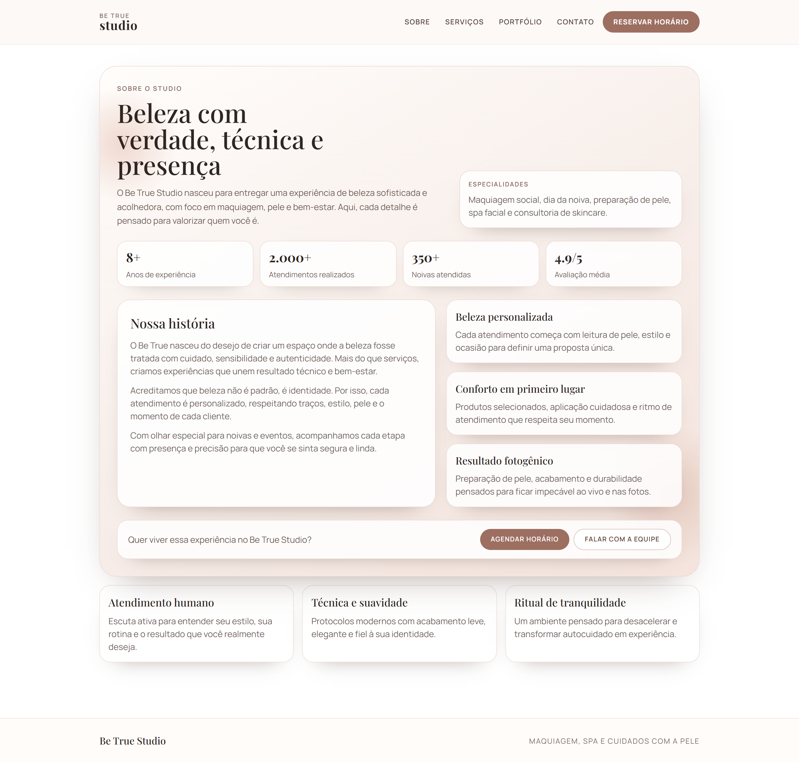
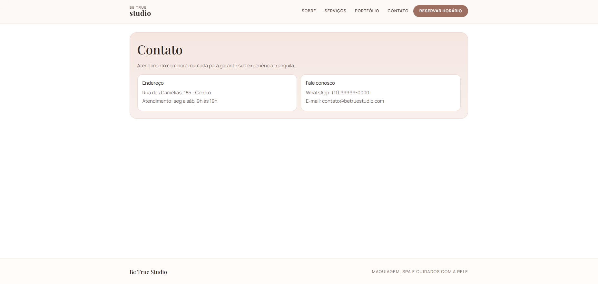
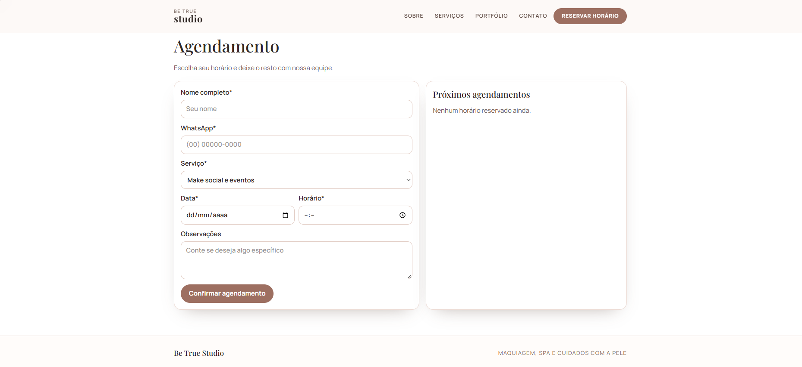

# ✧ Be True Studio ✧

<p align="left">
  
  
  
</p>

Site institucional para estúdio de make e spa, com foco em identidade visual, experiência do usuário e fluxo de agendamento.

## Páginas »

- `/Home`
- `/sobre`
- `/portfolio`
- `/agendamento`
- `/contato`

## Rodar localmente »

```bash
npm install
npm run dev
```

## Prévia (screenshots) »







## Vídeo de demonstração »

Para visualizar a prévia do projeto, acesse o link abaixo:

[Clique aqui!](https://github.com/Duududs/Be-True-Studio/tree/main/public/demo/Demonstração.mp4)
